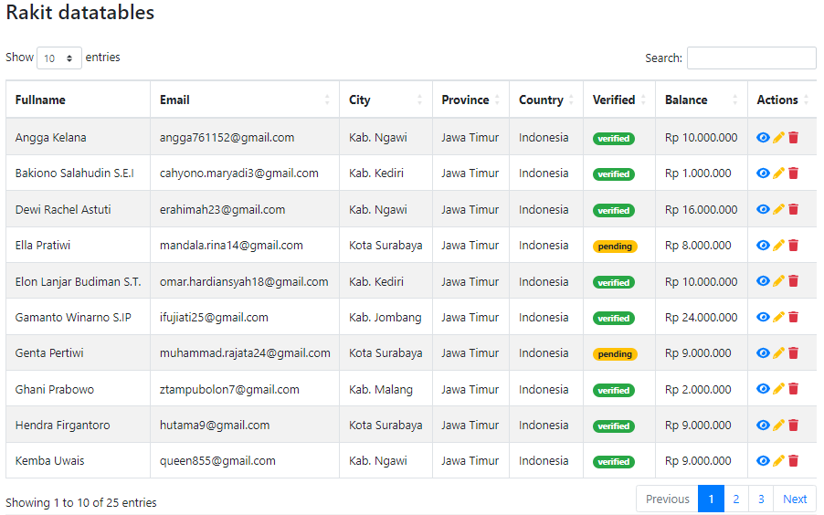

# datatables

<p align="center"></p>

Paket [DataTables](https://datatables.net) server-side untuk rakit framework.

## Instalasi
Jalankan perintah ini via rakit console:

```sh
php rakit package:install datatables
```


## Mendaftarkan paket

Tambahkan kode berikut ke file `application/packages.php`:

```php
'datatables' => ['autoboot' => true],
```


## Pengetahuan dasar

Untuk menggunakan bundel ini, cukup buat object facile model atau magic query builder
(tanpa memanggil `get()`, `all()` atau method serupa), dan dan oper object tersebut ke kelas `Datatables`
yang dibawa oleh paket ini.
Anda bebas menggunakan semua fitur Facile Model dan Query Builder.

Beberapa hal yang harus anda ketahui:
   - Saat anda memanggil `select()` pada Facile atau Query Builder, ini berarti anda sedang memilih kolom.
   - Anda dapat menghapus kolom apa pun dengan menggunakan method `forget()`.
   - Anda dapat menambah atau mengedit kolom menggunakan method `add()` atau `edit()`.
   - Anda dapat mengatur [index kolom](https://datatables.net/reference/api/row().index()) menggunakan method `index($name)`.
   - Anda dapat menambahkan `DT_RowClass` ke setiap tag `<tr>` menggunakan method `row_class()`.
   - Anda dapat menambahkan `DT_RowData` ke setiap baris menggunakan `row_data()`.
   - Anda dapat menambahkan filter pencarian kustom untuk setiap kolom sebagai pengganti fungsi pencarian default.


## Cara penggunaan

Untuk mulai menggunakan paket ini, silahkan import kelas `Esyede\Datatables` kedalam controller anda:

```php

use Esyede\Datatables; // Tambahkan ini

class Home_Controller extends Base_Controller
{
    public function action_index()
    {
        // ..
    }
}
```

Kemudian tambahkan assets datatables seperti biasa:

```html
<head>
    <!-- kode lain disini -->
    <link rel="stylesheet" type="text/css" href="https://cdnjs.cloudflare.com/ajax/libs/twitter-bootstrap/4.5.2/css/bootstrap.css">
    <link rel="stylesheet" type="text/css" href="https://cdn.datatables.net/1.12.1/css/dataTables.bootstrap4.min.css">
    <link rel="stylesheet" type="text/css" href="https://cdnjs.cloudflare.com/ajax/libs/font-awesome/6.2.0/css/all.min.css">
</head>
<body>

    <div class="table-responsive">
        <table id="table" class="table table-striped table-bordered">
            <thead>
                <tr>
                    <th>Fullname</th>
                    <th>Email</th>
                    <th>City</th>
                    <th>Province</th>
                    <th>Country</th>
                    <th>Verified</th>
                    <th>Balance</th>
                    <th>Actions</th>
                </tr>
            </thead>
            <tbody>
            </tbody>
        </table>
    </div>
    <script type="text/javascript" src="https://code.jquery.com/jquery-3.5.1.js"></script>
    <script type="text/javascript" src="https://cdn.datatables.net/1.12.1/js/jquery.dataTables.min.js"></script>
    <script type="text/javascript" src="https://cdn.datatables.net/1.12.1/js/dataTables.bootstrap4.min.js"></script>
    <script type="text/javascript" src="https://cdnjs.cloudflare.com/ajax/libs/font-awesome/6.2.0/js/all.min.js"></script>
    <script type="text/javascript">
        $(document).ready(function () {
            var table = $('#table').DataTable({
                'processing': true,
                'serverSide': true,
                'order': [],
                'ajax': {
                    'url': '<?php echo url('api/user/data'); ?>',
                    'type': 'POST'
                },
                'columnDefs': [{
                    'targets': [0],
                    'orderable': false,
                }],
            });
        });
    </script>
</body>
```

**Contoh 1: Penggunaan sederhana**

```php

$posts = Post::select(['id', 'name', 'created_at', 'status']);

return Datatables::of($posts)->make();
```


**Contoh 2: menambah, mengedit dan menghapus kolom**

```php
$posts = Post::select(['id', 'name', 'created_at', 'status']);

return Datatables::of($posts)
    ->edit('status', function ($item) {
        return ($item->status === 'published')
            ? '<span class="badge badge-success">Published</span>'
            : '<span class="badge badge-warning">Draft</span>';
    })
    ->add('operations', function ($item) {
        return '<a class="text-primary" href="post/detail/'.$item->id.'"><i class="fa-solid fa-eye"></i></a>&nbsp;'.
            '</a><a class="text-warning" href="post/edit/'.$item->id.'"><i class="fa-solid fa-pencil"></i></a>&nbsp;'.
            '<a class="text-danger" href="post/delete/'.$item->id.'"><i class="fa-solid fa-trash"></i></a>';
    })
    ->forget('id')
    ->make();
```


**Contoh 3: Filter kolom**

```php
$clients = client::select([
        'client.id',
        'fullname',
        'client.email',
        'client.code',
        'client.updated_at',
        'language.name as speaks',
    ])
    ->left_join('language', 'client.language_id', '=', 'language.id')
    ->where_null('deleted_at');

return Datatables::of($clients)
    ->filter('id', 'where', 'client.id', '=', '$1')
    ->filter('code', 'where', 'client.code', '=', DB::raw('UPPER($1)'))
    ->filter('speaks', 'where_in', 'language.name', function ($value) {
        return explode(',', $value);
    })
    ->filter('updated_at', 'where_between', 'client.updated_at', function ($value) {
        return explode(',', $value);
    }, 'and')
    ->make();
```

**Contoh 4: Penggunaan `DT_RowID`, `DT_RowClass` dan `DT_RowData`**

```php
$posts = Post::select(['id', 'name', 'created_at', 'status']);

return Datatables::of($posts)
    ->index('id')
    ->row_class('status', function ($item) {
        return ($item->status === 'published') ? 'badge-success' : 'badge-warning';
    })
    ->row_data('created_at', function ($item) {
        return Date::make($item->created_at)->format('c');
    })
    ->make();
```

Referensi API: https://datatables.net/manual/server-side#Returned-data


**Contoh 5: Penggunaan `columns.data`**

Jika perlu memanfaatkan fitur `column.data` bawaan dataTables,
anda dapat mengaktifkan konfigurasi `use_colums_data` atau mengoper `TRUE`
ke parameter ke-dua saat inisialisasi data seperti ini:

```php
Datatables::of($query, true)
```

Membuat datatables dengan tabel gabungan yang dapat dicari dan diurutkan:

```php
// HTML
<table id="table"></table>

// Javascript
$('#table').dataTable({
    'processing': true,
    'serverSide': true,
    'ajax': '<?php echo url('api/user/data'); ?>',
    'order': [[1,'desc']],
    'columnDefs': [{
        'targets': '_all',
        'defaultContent': ''
    }],
    'columns': [
        { 'data' : 'id',               'title' : 'Id',       'orderable': true, 'searchable': false },
        { 'data' : 'profile.last_name','title' : 'Name',     'orderable': true, 'searchable': true },
        { 'data' : 'username',         'title' : 'Username', 'orderable': true, 'searchable': true },
        { 'data' : 'email',            'title' : 'Email',    'orderable': true, 'searchable': true },
        { 'data' : 'created_date',     'title' : 'Created',  'orderable': true, 'searchable': true },
    ]
});

// Controller
$users = User::join('profile', 'profiles.user_id', '=', 'user.id');

return Datatables::of($users)
    ->filter('profile.last_name', 'where', DB::raw('CONCAT(profile.last_name, " ",profile.first_name)'), 'LIKE', '$1')
    ->filter('created_at', 'where', 'users.created_at', 'LIKE', '$1')
    ->edit('created_at', function ($item) {
        return Date::make($item->created_at)->format('d M Y, h:i');
    })
    ->add('actions', function ($item) {
        return '<a href="'.url('user/edit/'.$iitem->id).'" >Edit</a>';
    }, 3)
    ->forget('profile.photo_id')
    ->make();
```

Referensi: https://datatables.net/reference/option/columns.data


## Lisensi

Paket ini dirilis dibawah [Lisensi MIT](https://github.com/esyede/datatables/master/LICENSE)
